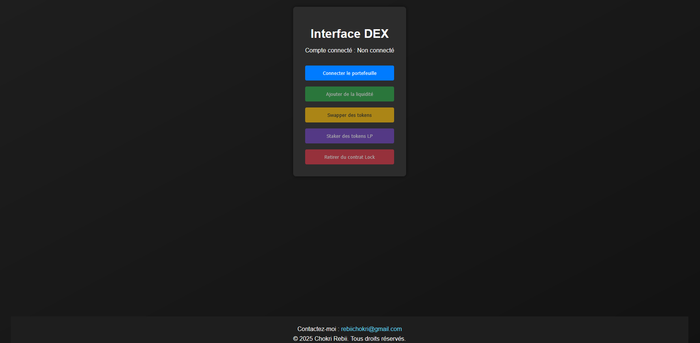

## DEX Project

A decentralized exchange (DEX) prototype built with Solidity and React, using Hardhat for local deployment.

### 🧠 Overview

This educational project showcases core DEX functionalities:

* 🧾 **Smart Contracts**: Written in Solidity – includes `DEXPair`, `Router`, `Staking`, `Lock`, and a custom `RewardToken`.
* 🌐 **Frontend**: React app for interacting with contracts – add liquidity, swap tokens, stake LP tokens, withdraw.
* ⚙️ **Deployment**: Hardhat scripts for local blockchain deployment.

### 🚀 Features

* Add liquidity to token pairs
* Swap tokens via a router
* Stake LP tokens for rewards
* Lock & withdraw ETH using a timed contract
* Local Hardhat simulation for testing

---

### 🔧 Prerequisites

Ensure the following are installed:

* Node.js (v16+)
* npm (included with Node.js)
* Git (for cloning)
* MetaMask (browser extension)

---

### 📦 Installation

```bash
# Clone the repository
git clone https://github.com/your-username/dex-project.git
cd dex-project

# Install backend dependencies
npm install

# Install frontend dependencies
cd frontend
npm install
cd ..
```

---

### ▶️ Usage

**1. Start Local Blockchain**

```bash
npx hardhat node
```

**2. Deploy Contracts**

```bash
npx hardhat run scripts/deploy.js --network localhost
```

**3. Update Frontend Addresses**

Edit `frontend/src/App.js` with deployed contract addresses:

```js
const routerAddress = "0x...";
const stakingAddress = "0x...";
const lockAddress = "0x...";
const tokenAAddress = "0x...";
const tokenBAddress = "0x...";
```

> Note: Token A and B should be separate tokens for proper swaps.

**4. Start the Frontend**

```bash
cd frontend
npm start
```

---

### 🧪 Interact

* Visit `http://localhost:3000`
* Connect MetaMask to the Hardhat network:

  * RPC: `http://127.0.0.1:8545`
  * Chain ID: `31337`
* Import test account from Hardhat using private key

Use the interface to:

* Add liquidity
* Swap tokens
* Stake LP tokens
* Withdraw from the lock contract

---

### 📁 Project Structure

```
dex-project/
├── contracts/       # Solidity contracts
├── scripts/         # Deployment scripts
├── frontend/        # React frontend
├── hardhat.config.js
├── package.json
└── README.md
```

---

### ⚠️ Known Issues

* Same token used for both Token A & B – deploy separately for full DEX functionality.
* Lock contract unlock time defaults to 1h – adjust in `deploy.js` for testing.

---

### 🔮 Future Improvements

* Deploy on a testnet (e.g. Sepolia)
* Separate TokenA & TokenB contracts
* Improve UI/UX
* Add approval logic & unit tests

---

### 🖼️ Interface Utilisateur

Voici une capture d'écran de l'interface DEX :



---

### 🤝 Contributing

1. Fork the repo
2. Create a branch: `git checkout -b feature/your-feature`
3. Commit your changes: `git commit -m "Add your feature"`
4. Push: `git push origin feature/your-feature`
5. Create a pull request

---

### 📄 License

MIT License
